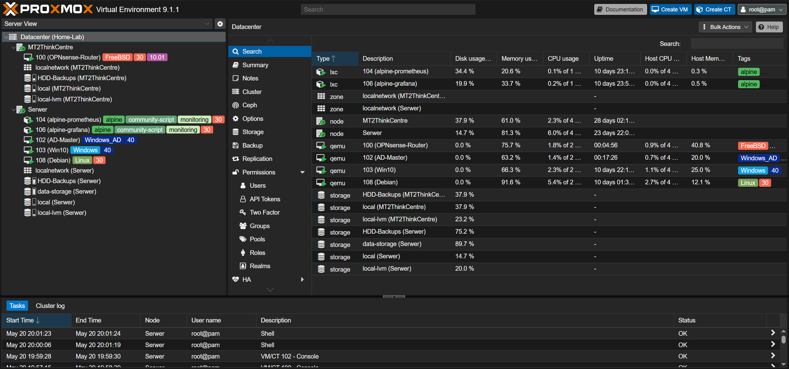

# 🏠 Home Lab

Welcome to my home lab repository. This project documents my hardware infrastructure, configuration files, and performance benchmarks.

## 🖥️ Hardware Specifications

| Device | Model | CPU | RAM | Storage |
| :--- | :--- | :--- | :--- | :--- |
| **Node 1** | Lenovo ThinkCentre M73 | Intel Core i3-4130T (2 Cores @ 2.9GHz) | 8GB DDR3| 120GB SSD |
| **Node 2** | Dell OptiPlex 5050 | Intel Core i5-6500 (4 Cores @ 3.2GHz) | 16GB DDR4 | 256GB SSD |
| **Network** | TL-SG108E | managed switch | - | - |

## ⚙️ Software & Configuration

### Node 1: Lenovo ThinkCentre M73
| ID | Name | Type | OS | Description |
| :--- | :--- | :--- | :--- | :--- |
| **113** | Wonder2 | VM | FreeBSD | Game Server |
| **114** | Mt2 | VM | FreeBSD | Game Server |

### Node 2: Dell OptiPlex 5050
| ID | Service/Name | Type | OS | Note |
| :--- | :--- | :--- | :--- | :--- |
| **100** | Grafana | LXC | Host | Monitoring Visualization (Community Script) |
| **103** | Prometheus | LXC | Host | Monitoring Database (Community Script) |
| **101** | Ubuntu | VM | Ubuntu | Base VM |
| **102** | Minecraft Server | VM | Ubuntu Server | Game Server |
| **104** | BuildAndShoot | VM | Ubuntu Server | Game Server |
| **105** | OPNsense | VM | FreeBSD | Firewall |

UPDATE 14.03.2026
 -I made major improvement in my homelab security and in infrastructure. Added OPNsense as Vm in my node 2

 UPDATE 15.03.2026
 -Configured Unbound DNS on OPNsense to act as a network-wide ad, tracker, and malware blocker.
 -Installed and configured the CrowdSec plugin on OPNsense. It automatically fetches global threat intelligence lists, instantly blocking known attackers and malicious IP addresses from around the world directly at the firewall level.