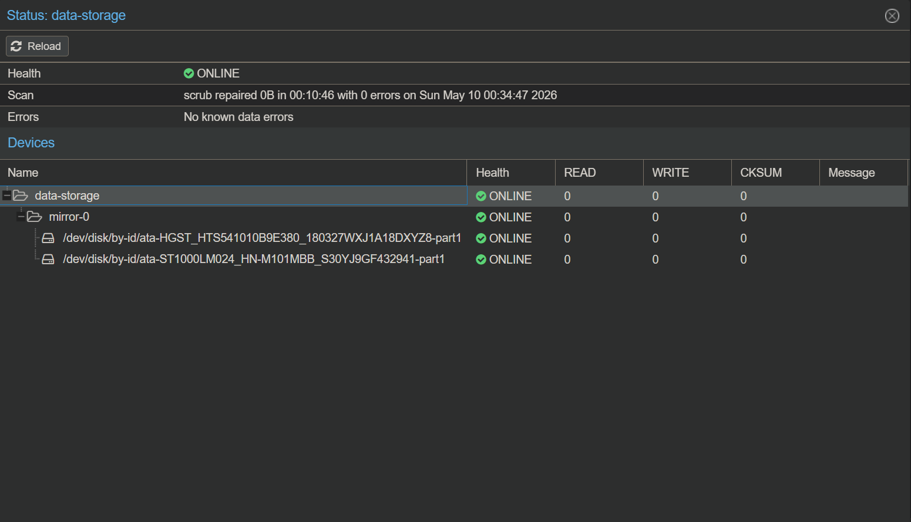
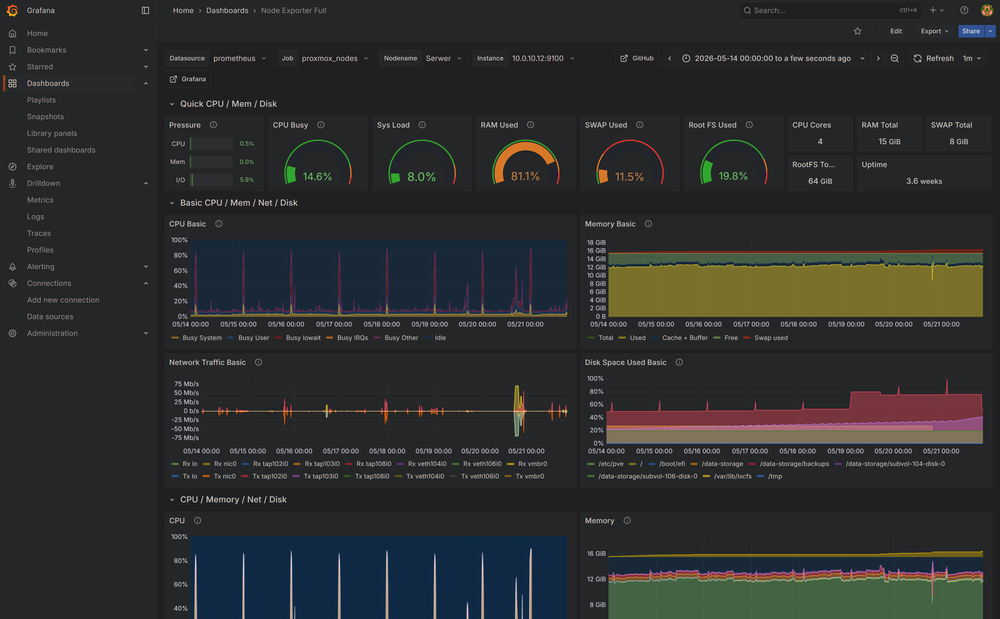

# 🏠 Home-Lab

Welcome to my home lab repository. This project documents my hardware infrastructure, configuration files, and performance benchmarks.

## 🖥️ Hardware Specifications

| Device | Model | CPU | RAM | Storage |
| :--- | :--- | :--- | :--- | :--- |
| **Node 1** | Lenovo ThinkCentre M73 | Intel Core i3-4130T (2 Cores @ 2.9GHz) | 8GB DDR3| 120GB SSD |
| **Node 2** | Dell OptiPlex 5050 | Intel Core i5-6500 (4 Cores @ 3.2GHz) | 16GB DDR4 | 256GB SSD | 2tb HDD |
| **Network** | TL-SG108E | managed switch | - | - |

## ⚙️ Software & Configuration

### Node 1:  ThinkCentre M73
| ID | Name | Type | OS | Description |
| :--- | :--- | :--- | :--- | :--- |
| **100** | OPNsense-Router | VM | FreeBSD | Firewall |

### Node 2: Serwer
| ID | Service/Name | Type | OS | Note |
| :--- | :--- | :--- | :--- | :--- |
| **104** | alpine-prometheus | LXC | Host | Monitoring Database (Community Script) |
| **106** | alpine-grafana | LXC | Host | Monitoring Visualization (Community Script) |
| **102** | AD-Master | VM | Windows Server 2022 | Windows Active Directory |
| **103** | Win10 | VM | Windows 10 | guest system |
| **108** | Debian | VM | Linux(Debian) | Torrents |

UPDATE 14.03.2026r
 -I made major improvement in my homelab security and in infrastructure. Added OPNsense as Vm in my node 2

 UPDATE 15.03.2026r
 -Configured Unbound DNS on OPNsense to act as a network-wide ad, tracker, and malware blocker.
 -Installed and configured the CrowdSec plugin on OPNsense. It automatically fetches global threat intelligence lists, instantly blocking known attackers and malicious IP addresses from around the world directly at the firewall level.

 UPDATE 20.05.2026r
 -Environment Reinstallation: Clean installation of the hypervisor (Proxmox VE) on both cluster nodes (Lenovo ThinkCentre M73 and Dell Optiplex 5050).

 -Network Services Isolation: Migration of the core virtual machine (OPNsense router) to the dedicated Lenovo M73 node. Separating the base network from resource-intensive VMs protects routing from downtime during the second node's restarts and improves hardware resource allocation.

 -Active Directory Lab: Deployment of a test environment featuring Windows Server 2022 and Windows 10 for learning Active Directory (new machines assigned to VLAN 40 by default).

 -Monitoring Optimization: Rebuild of the node monitoring containers. Migration of LXC containers to lightweight Alpine Linux base images, which significantly reduced resource consumption compared to default distributions.

 UPDATE 21.05.2026r

 - RAID 1 (Mirror) Implementation:** Configured a mirrored array using two 1 TB drives to ensure data redundancy. 

 - Storage Optimization (Root FS at 98%):** Storing backups on a small SSD previously led to critical capacity issues on the root partition. To optimize the infrastructure, i add dedicated storage pool was provisioned for backups and `.iso` images, effectively offloading the primary root file system. 